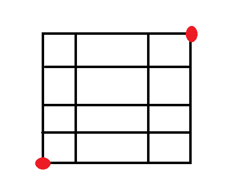
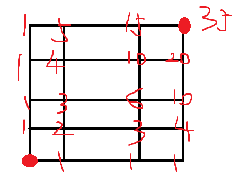

# 题目

- 给一个n*m的方格, 求左下角的点到右上角点的最短距离的路径数

- 例如: 给一个4*3的方格, 如下图, 从左下角到右下角.

# 分析

### 解法1:

1. 由图可知, 从左下角到右上角最短距离是走七步,且有三步向右, 四步向上

2. 所以, 其实就是组合问题,七步中取三步向右即为所求, 即 C(7,3) = 35

### 解法2:

1. 最短距离实际上有两个方向组成, 上和右
2. 所以可以计数每个点等于到它左边和下边两个点的和

